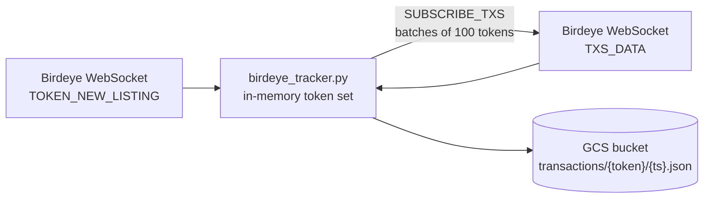

# Solana DEX trades collector (Birdeye WebSocket → GCS)

A small streaming ingestion service. It discovers newly listed Solana tokens through the [Birdeye](https://docs.birdeye.so/) WebSocket API, subscribes to swap transactions for those tokens and stores every transaction as a raw JSON object in Google Cloud Storage. The output is a raw landing zone for later analysis of early trading activity in new tokens.

## Pipeline



| Stage | What happens in the code |
|---|---|
| Ingestion | `websockets` client subscribes to `SUBSCRIBE_TOKEN_NEW_LISTING`; for each new token address it sends `SUBSCRIBE_TXS` with a `complex` query (up to 100 addresses per message). Reconnects after 5 s when the connection closes. |
| Transformation | Light parsing only: the payload is normalised to a dict, the token address is taken from `tokenAddress` or `to.address`, and `blockUnixTime` is converted to a UTC timestamp for the object name. The payload itself is stored unchanged. |
| Storage | One JSON object per transaction in GCS: `transactions/<token_address>/<YYYY-MM-DD_HH-MM-SS>.json`. |
| Consumption | Not part of this repo. Files are intended for downstream batch processing (e.g. loading into a warehouse). |

## Stack

- **Python 3.9+, asyncio** — single-process service
- **websockets** — Birdeye WebSocket client
- **google-cloud-storage** — writes raw JSON objects to GCS
- **http.server** — minimal `GET /` health endpoint on `$PORT`, required by Cloud Run
- **Google Cloud Run** — target runtime

## Configuration

Copy `.env.example` and set the values. Never commit real keys.

| Variable | Required | Default | Purpose |
|---|---|---|---|
| `BIRDEYE_API_KEY` | yes | — | Birdeye API key |
| `GCS_BUCKET_NAME` | no | `birdeye-tracker-bucket` | Target bucket |
| `BIRDEYE_CHAIN` | no | `solana` | Chain in the WebSocket URL |
| `PORT` | no | `8080` | Health-check port (set by Cloud Run) |

GCS access uses Application Default Credentials: `gcloud auth application-default login` locally, the service account on Cloud Run.

## Run locally

```bash
python -m venv .venv && source .venv/bin/activate
pip install -r requirements.txt
set -a && source .env && set +a
python birdeye_tracker.py
```

## Deploy to Cloud Run

The repository does not contain a Dockerfile yet; build an image first, then:

```bash
gcloud run deploy birdeye-tracker \
  --image=REGION-docker.pkg.dev/PROJECT/REPO/birdeye-tracker:latest \
  --region=REGION \
  --set-env-vars=GCS_BUCKET_NAME=your-bucket \
  --set-secrets=BIRDEYE_API_KEY=birdeye-api-key:latest \
  --cpu=0.25 --memory=512Mi
```

The service keeps a long-lived WebSocket connection, so instance CPU must stay allocated between HTTP requests and the service should run as a single instance (see limitations).

## Output example

Object path:

```
gs://<bucket>/transactions/<token_address>/2025-03-21_01-30-38.json
```

Object content is the Birdeye `TXS_DATA` payload as received. The fields the code relies on (other fields are omitted here):

```json
{
  "blockUnixTime": 1742520638,
  "to": { "address": "<token_address>" }
}
```

## Limitations

- Tracked tokens live in memory: after a restart the service only follows tokens listed after the restart.
- Not horizontally scalable as is: several instances would each subscribe to the same stream and write duplicates.
- Object names have one-second resolution, so two swaps of the same token within the same second overwrite each other.
- No schema validation, deduplication or dead-letter storage for malformed messages; they are logged and skipped.
- Every incoming message is logged at INFO level, which is noisy and costly on Cloud Logging.

## License

MIT
